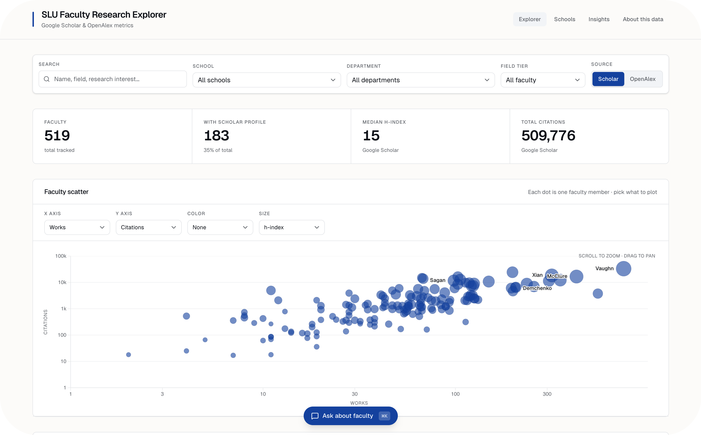

# SLU Faculty Research Explorer

Interactive bibliometric dashboard for Saint Louis University's 519 active PhD faculty. Combines Google Scholar and OpenAlex data to visualize research productivity, citation impact, and field-normalized rankings.

**Live:** [faculty.jacobmaynard.dev](https://faculty.jacobmaynard.dev)



## Features

- **Explorer** -- Filterable scatter chart and sortable faculty table. Search by name, department, or research interests. Toggle between Scholar and OpenAlex metrics.
- **Schools** -- Strip charts and drill-down tables comparing research output across schools and departments.
- **Insights** -- Presentation-ready analytics: tier distributions, FWCI histograms, m-index by career stage, admin role impact, field benchmarks.
- **AI Chat** -- Cmd+K to query the dataset in natural language. The assistant calls tools to look up faculty, compute rankings, run custom analyses (sandboxed JS via QuickJS), and configure the scatter chart.

## Stack

| Layer         | Tech                                                    |
| ------------- | ------------------------------------------------------- |
| Framework     | React 19, TanStack Start, TanStack Router               |
| Hosting       | Cloudflare Workers                                      |
| State         | Zustand                                                 |
| Visualization | D3 (scatter), Recharts (insights)                       |
| AI            | TanStack AI + OpenRouter (GPT 5.4 Mini / DeepSeek V3.2) |
| Styling       | Tailwind CSS 4, shadcn/ui                               |
| Build         | Vite 7, pnpm                                            |

## Development

```bash
pnpm install
pnpm dev
```

Requires `OPENROUTER_API_KEY` in `.env` for the AI chat feature.

## Data Pipeline

The `pipeline/` directory contains the Python pipeline that builds and updates the dataset. Monthly refresh:

```bash
cd pipeline
uv run python update.py    # refresh metrics, diff, publish to public/
```

See [`pipeline/DESIGN.md`](pipeline/DESIGN.md) for full methodology, schema, run order, and data quality notes.
